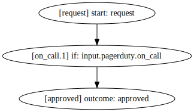
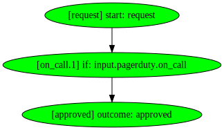
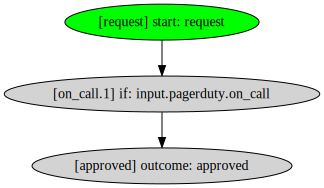
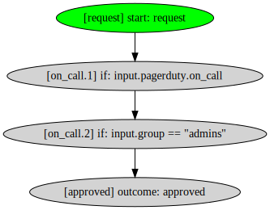
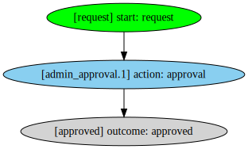
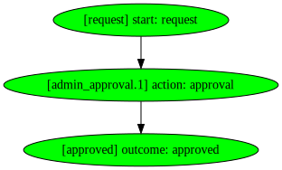
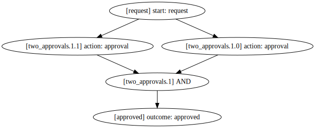
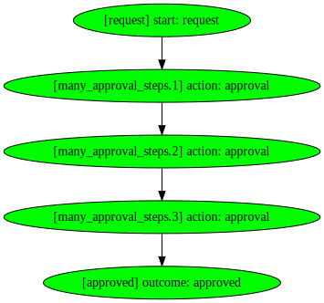
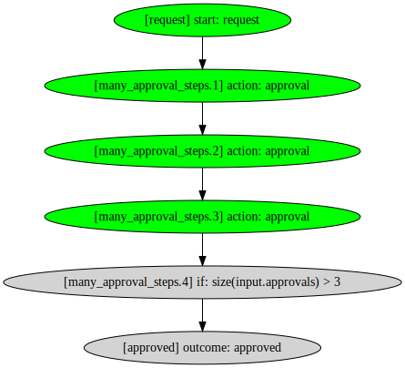

# Overview

This walkthrough assumes that you've installed the `glide` CLI tool. You can do so by running

```
make cli
```

From this repository.

The best way to play with the Glide syntax is to test it out online at https://play.commonfate.io.

## Workflow Definition

Workflows in Glide are defined using YAML. A simple workflow definition is shown below.

```yaml
workflow:
  on_call:
    steps:
      - start: request
      - check: input.pagerduty.on_call
      - outcome: approved
```

When compiled, the workflow definition above produces the following:



Note: we call this output an "Execution Graph". We’ll get into that in the following section.

Let’s break down the syntax here. Workflows themselves are defined using the top level "workflow" key:

```yaml
workflow: # <- workflow
```

A workflow consists of one or more Paths. Each path is a possible approach to go from the start of a workflow to an outcome.

```yaml
workflow:
  on_call: # <- path
```

Each path consists of multiple steps. Each step represents a particular part of a path.

```yaml
workflow:
  on_call:
    steps:
      - start: request # <- step
      - check: input.pagerduty.on_call # <- step
      - outcome: approved # <- step
```

Steps are read in sequential order, from top to bottom. A way to think of the workflow above in English is as follows:

> Start at the request. Check if the user is on call. Finish at the approved outcome.

Each path must start with a "start" step, and finish with an "outcome" step.

## Input

Glide workflows are executed on input data. The input data is a JSON object like the following:

```json
{
  "pagerduty": {
    "on_call": true
  }
}
```

The input data is **strongly typed** and must adhere to an expected schema. The schema is provided in JSON schema format. For example:

```json
{
  "$id": "https://example.com/workflow.schema.json",
  "$schema": "http://json-schema.org/draft-07/schema#",
  "type": "object",
  "properties": {
    "pagerduty": {
      "type": "object",
      "properties": {
        "on_call": {
          "type": "boolean"
        }
      }
    }
  }
}
```

## The Execution Graph

When we run the example workflow with the input data shown above, we get this result:



We call each step in the above graph a 'node'. The nodes are colored green if they are completed. In this case, you can see that we reached an outcome node. This means that the workflow has been completed, with an "approved" outcome.

We can run the example workflow again with a different input:

```json
{
  "pagerduty": {
    "on_call": false
  }
}
```

and get the following result:


In this case, only the request node is complete. If we don't reach an output node, we say that the workflow is still in progress.

Steps in the Execution Graph can only be completed if at least one of their predecessors are complete. Let's see this in action.

The following workflow definition:

```yaml
workflow:
  example:
    steps:
      - start: request
      - check: input.pagerduty.on_call
      - check: input.group == "admins"
      - outcome: approved
```

With the following input:

```json
{
  "pagerduty": {
    "on_call": false
  },
  "group": "admins"
}
```

Results in the Execution Graph below:



Even though the `input.group` field was indeed equal to `"admins"`, the workflow does not advance beyond the `request` node, because the first `input.pagerduty.on_call` condition was not satisfied.

## Checks

Glide workflows may contain Checks. You've seen some of these in action above, in the previous section. Checks are steps with a `check` key:

```yaml
workflow:
  example:
    steps:
      # ...
      - check: input.pagerduty.on_call # <- Check step
      # ...
```

Checks are [Common Expression Language (CEL)](https://github.com/google/cel-spec) expressions which are evaluated on the input.

Some examples of check expressions are shown below:

```yaml
- check: input.group.startsWith("admin-") # group must start with 'admin-'

- check: input.location.country == "UK" # country must be "UK"

- check: input.resource.kubernetes.namespace.labels.exists(l, input.groups.exists(g, g == l)) # one of the entries in the "labels" array must match one of the entries in the "groups" array
```

You can read more about CEL [here](https://github.com/google/cel-spec/blob/master/doc/langdef.md).

CEL also supports boolean logic, using the `&&` and `||` operators:

```
input.verified && input.resource.is_dev

input.verified || input.groups == "admin"
```

Checks must evaluate to `true` or `false`. If a check evaluates to `true`, the step is complete and the workflow progresses to the next step. If a check evaluates to `false`, it is not completed.

## Actions

Glide workflows may also contain Actions. Actions are a special kind of step which can cause [side effects](<https://en.wikipedia.org/wiki/Side_effect_(computer_science)>) in workflows. Examples of these side effects are things like:

- Assigning other users as reviewers for an access request
- Displaying a prompt to the user ("confirm you wish to access this breakglass role")
- Prompt the user for an MFA authentication

Here's an example of an Action step:

```yaml
workflow:
  example:
    steps:
      # ...
      - action: approval # <- Action step
        with:
          groups: [admins] # action parameters
      # ...
```

Actions may contain a `with` key, which specifies particular parameters for the given action.

In English, you can read the example above as:

> Require approval from the 'admins' group.

An action may be **activated** in the Execution Graph. This is indicated by shading the node in blue. Here's an example workflow:

```yaml
workflow:
  admin_approval:
    steps:
      - start: request
      - action: approval
        with:
          groups: [admins]
      - outcome: approved
```

With the input data:

```json
{
  "approvals": []
}
```

Which gives the following results when executed:



When the action node is activated, we know that we need to send a notification to the `admins` group and assign them as approvers of the workflow.

Action nodes read the same input JSON data as Check nodes to determine whether they are complete. For example, if we re-ran the above workflow with the following input:

```json
{
  "approvals": [
    {
      "user": "chris@commonfate.io",
      "groups": ["admins"]
    }
  ]
}
```

We'd get this result:



And the workflow is now complete, with an `approved` outcome.

## Re-running workflows

Glide is built on the idea that the Execution Graph will be run many times during a workflow. Each time we receive updated input data, we can re-run the Execution Graph to determine whether we've reached an outcome on the workflow, and whether

An analogy here is that a Glide workflow is a series of pipes and valves. We've mixed a special liquid substance (this is the input data), and we pour this into the start of the workflow pipes. Each step is a valve which analyses the liquid and opens, or remains shut.

After we've poured the liquid, we take a photo of the pipes and valves. This is the state of the Execution Graph. If the liquid gets to the end of our pipes, we've reached an outcome.

In future, we can try pouring a different liquid down the same pipes and valves, and then take another photo to see where it got to.

## Boolean logic

While CEL expressions in Checks support boolean logic, it can be useful to combine multiple steps together with boolean logic too. Glide supports this with `and` and `or` steps. For example:

```yaml
workflow:
  two_approvals:
    steps:
      - start: request
      - and:
          - action: approval
            with:
              groups: [admins]
          - action: approval
            with:
              groups: [ops]
      - outcome: approved
```

This workflow compiles into the following Execution Graph:



You can also use `or`:

```yaml
workflow:
  two_approvals:
    steps:
      - start: request
      - or:
          - action: approval
            with:
              groups: [admins]
          - action: approval
            with:
              groups: [ops]
      - outcome: approved
```

## Action steps don't consume input

Something to be aware of is that Action steps do not 'consume' the workflow input. Here is an example to illustrate this:

Workflow definition:

```yaml
workflow:
  many_approval_steps:
    steps:
      - start: request
      - action: approval
        with:
          groups: [admins]
      - action: approval
        with:
          groups: [admins]
      - action: approval
        with:
          groups: [admins]
      - outcome: approved
```

Input:

```json
{
  "approvals": [
    {
      "user": "chris@commonfate.io",
      "groups": ["admins"]
    }
  ]
}
```

Result:



You can see that although we only had one approval, all of the steps in the workflow are complete!

In future we'll aim to address this, but it makes graph execution a lot more complicated. For now, it is best to combine multiple approval steps with a check step to verify that at least N number of people have approved the access:

Workflow definition:

```yaml
workflow:
  many_approval_steps:
    steps:
      - start: request
      - action: approval
        with:
          groups: [admins]
      - action: approval
        with:
          groups: [admins]
      - action: approval
        with:
          groups: [admins]

      # add a check for the count of approvals
      - check: size(input.approvals) > 3

      - outcome: approved
```

Input:

```json
{
  "approvals": [
    {
      "user": "chris@commonfate.io",
      "groups": ["admins"]
    }
  ]
}
```

Result:



Which avoids the workflow becoming instantly approved.

[Back to README](/README.md)
